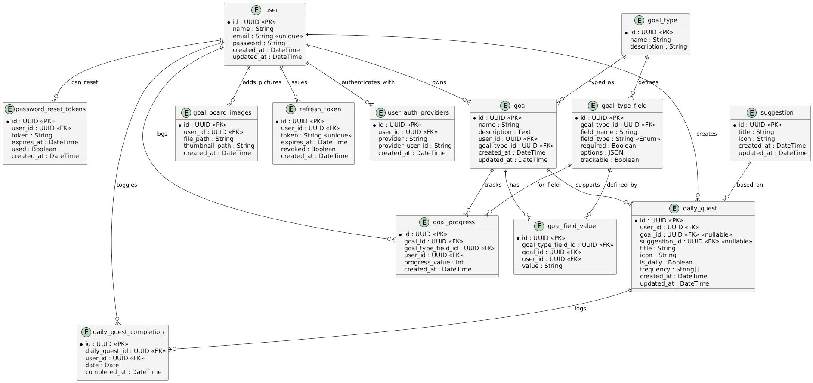

# Goal Tracker

This will be the API for the front-end React app part of our practicum project.

These instructions are for the **front-end team** so they can setup their local development environment to run
both the back-end server and their front-end app.

> The back-end server will be running on port 8000. The front-end app will be running on port 5173. You will need to run
> both the back-end server and the front-end app at the same time to test your app.

## Setting up local development environment

1. Create a folder to contain both the front-end and back-end repos
2. Clone this [repository](https://github.com/Code-the-Dream-School/ii-practicum-team-2-back.git) to that folder
3. Create `.env` file in the root of backend folder (you can copy from `.env.example` and set it with your vars)
4. Run `npm install` to install dependencies inside backend directory
5. Run `npm run prisma:migrate` to apply migrations
6. Run `npm run dev` to start the development server
7. Open http://localhost:8000/api/v1/ with your browser to test
8. Your back-end server is now running. You can now run the front-end app
9. Swagger API Docs are available at http://localhost:8000/docs (json format at http://localhost:8000/docs.json)

> N.B. Start every coding session with pulling `main` branch of this repository.

### Logs

Logs can be observed in `logs/`:

- all logs with level `error` (and below) will be in `logs/error.log`;
- all logs with level `info` (and below) will be in `logs/app.log`;
- all logs NOT in production will be in console as well.

### To build TS into JS (production ready)

`npm run build` and then you can run `npm run start`

### Running ESLint

`npm run lint` - to check everything.
`npm run lint:fix` - to fix everything.

### Running Prettier

`npm run prettier:write` - to format everything.

### Using Prisma

Use this every time you:

- Add/edit a model.
- Rename fields.
- Change enum values.
- Add new relations.

#### Create + apply a new migration to your dev database

`npm run prisma:migrate`

This command runs `prisma:generate` under the hood as well.

#### Generate latest Prisma client for TypeScript

`prisma generate`

> ⛔️ Never use `migrate dev` in production — it may reset or seed the DB!

#### Seed DB with testing data

`npm run prisma:seed`

#### Run Prisma studio and observe DB data

`prisma studio`

## DB Schema



### Diagram as a code:

Can be pasted on https://planttext.com/ (click “Refresh” to generate diagram)

<details>
  <summary>Click to expend</summary>

```
@startuml

' === USERS ===
entity user {
  *id : UUID <<PK>>
  name : String
  email : String <<unique>>
  password : String
  created_at : DateTime
  updated_at : DateTime
}

entity user_auth_providers {
  *id : UUID <<PK>>
  user_id : UUID <<FK>>
  provider : String
  provider_user_id : String
  created_at : DateTime
}

entity password_reset_tokens {
  *id : UUID <<PK>>
  user_id : UUID <<FK>>
  token : String
  expires_at : DateTime
  used : Boolean
  created_at : DateTime
}

entity refresh_token {
  *id : UUID <<PK>>
  user_id : UUID <<FK>>
  token : String <<unique>>
  expires_at : DateTime
  revoked : Boolean
  created_at : DateTime
}

' === GOALS & PROGRESS ===
entity goal {
  *id : UUID <<PK>>
  name : String
  description : Text
  user_id : UUID <<FK>>
  goal_type_id : UUID <<FK>>
  created_at : DateTime
  updated_at : DateTime
}

entity goal_type {
  *id : UUID <<PK>>
  name : String
  description : String
}

entity goal_type_field {
  *id : UUID <<PK>>
  goal_type_id : UUID <<FK>>
  field_name : String
  field_type : String <<Enum>>
  required : Boolean
  options : JSON
  trackable : Boolean
}

entity goal_field_value {
  *id : UUID <<PK>>
  goal_type_field_id : UUID <<FK>>
  goal_id : UUID <<FK>>
  user_id : UUID <<FK>>
  value : String
}

entity goal_progress {
  *id : UUID <<PK>>
  goal_id : UUID <<FK>>
  goal_type_field_id : UUID <<FK>>
  user_id : UUID <<FK>>
  progress_value : Int
  created_at : DateTime
}

' === DAILY QUESTS ===
entity daily_quest {
  *id : UUID <<PK>>
  user_id : UUID <<FK>>
  goal_id : UUID <<FK>> <<nullable>>
  suggestion_id : UUID <<FK>> <<nullable>>
  title : String
  icon : String
  frequency : String[]
  created_at : DateTime
  updated_at : DateTime
}

entity daily_quest_completion {
  *id : UUID <<PK>>
  daily_quest_id : UUID <<FK>>
  user_id : UUID <<FK>>
  date : Date
  completed_at : DateTime
}

' === GOAL BOARD Images (Image Uploads) ===
entity goal_board_images {
  *id : UUID <<PK>>
  user_id : UUID <<FK>>
  file_path : String
  thumbnail_path : String
  created_at : DateTime
}

' ===  DAILY QUESTS SUGGESTIONS ===
entity daily_quest_suggestion {
  *id : UUID <<PK>>
  title : String
  icon : String
  created_at : DateTime
  updated_at : DateTime
}

' === RELATIONSHIPS ===
user ||--o{ user_auth_providers : authenticates_with
user ||--o{ password_reset_tokens : can_reset
user ||--o{ refresh_token : issues
user ||--o{ goal : owns
goal_type ||--o{ goal : typed_as
goal_type ||--o{ goal_type_field : defines
goal ||--o{ goal_field_value : has
goal_type_field ||--o{ goal_field_value : defined_by
goal ||--o{ goal_progress : tracks
goal_type_field ||--o{ goal_progress : for_field
user ||--o{ goal_progress : logs

user ||--o{ daily_quest : creates
goal ||--o{ daily_quest : supports
daily_quest_suggestion ||--o{ daily_quest : based_on
daily_quest ||--o{ daily_quest_completion : logs
user ||--o{ daily_quest_completion : toggles

user ||--o{ goal_board_images : adds_pictures

@enduml
```

</details>
